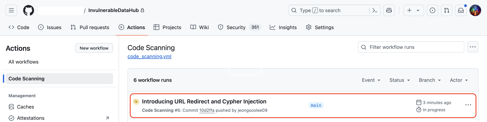

<h1 align="center">Push past default mode: Using CodeQL with models and custom queries</h1>
<h5 align="center">
    <a href="https://github.com/jeongsoolee09"><code>@jeongsoolee09</code></a>,
    <a href="https://github.com/therealkujo"><code>@therealkujo</code></a>
</h5>

<p align="center">
    <a href="#mega-prerequisites">Prerequisites</a> •
    <a href="#books-resources">Resources</a> •
    <a href="#learning-objectives">Learning Objectives</a>
</p>

Have an internal library or a framework? Have an awesome dependency publicly available but is not yet supported by us? Model the APIs really fast with Model-as-Data and the low-code point-and-click Model Editor so CodeQL runs smoothly on your codebase. And guess what? You'll be writing 0 lines of CodeQL along the way. Let's get started!

- **Who this is for**: Security teams and security-conscious software developers, both working in the Open-source and enterprise space.
- **What you'll learn**:
  - Learn how models empower both default and custom CodeQL queries.
  - Learn what Model-as-Data is, and how to use the model editor to compose model definitions in Model-as-Data.
  - Learn how to upload and deploy models and queries to the cloud to use them in Code Scanning.
  - Get a whirlwind tour of GHAS and Code Scanning.
- **What you'll build**:
  - A collection of models of the APIs used in an open source application called DataHub.
    - The version of this DataHub has 10 different vulnerabilities of which 2 need their source and sinks modeled for CodeQL to detect it. Consider this application as an innersource application and the unmodeled functions as your organization-specific API functions.

## Learning Objectives

In this workshop, you will:

- Learn how models contribute to finding a true positive,
- Have a hands-on session to write strings in model-as-data, a simple yet powerful way of modeling security-critical APIs, both using a low-code editor and by hand, and
- Learn how to deploy the developed models and take them into action with org-level model packs and Code Scanning!

## :mega: Prerequisites

There are two ways to set up a development environment for this workshop:

- (Recommended!) The process is very simple if you have decided to use Codespaces!
- You can set up a local environment if you'd like to, which is more involved.

### Using Codespaces

1. In the main page of this repository, click on the green button named `Code` to reveal the Codespaces tab. Don't click on the `+` button if you're tempted to; instead, click on the three dots (`...`) for more customizations and choose `+ New with options` among them.
<p align="center">
    
</p>
2. Then, make sure to select the most powerful option with the greatest number of cores (it usually comes with the most memory capacity as well).
<p align="center">
    
</p>
3. Click `Create Codespace`, then you're in the Codespace created just for you! - _**Click `Never`**_ if you see a notification that says `This repository has an origin (GitHub) that may have one or more CodeQL databases. Connect to GitHub and download any existing databases?`, since we're using our own database here.
<p align="center">
    
</p>
4. You'll see a `datahub-db.zip` in the root of the repository. That's the zip archive that contains the database built from the vulnerable version of DataHub. Make the CodeQL extension pick it up by:
   1. Press `Ctrl+Shift+p` (or `Cmd+Shift+p` on a Mac) to open the Command Palette, and select `Codeq: Choose Database From Folder`.
   <p align="center">
       
   </p>
   2. Select `datahub-db.zip`.
   <p align="center">
       
   </p>
   3. Now, you should see a check mark (make sure its color is not red!) that the database is successfully selected.
   <p align="center">
       
   </p>

You're all done!

### Setting up a local environment

Before joining the workshop, please follow these simple steps to get started!

1. Clone the repository and open it in VSCode by pressing `Ctrl+Shift+p` to open the Command Palette and choosing `File: Open Folder`.
   - Download VSCode [here](https://code.visualstudio.com/download) if you haven't already.
   <p align="center">
       
   </p>
2. Download the CodeQL CLI binary at [here](https://github.com/github/codeql-cli-binaries/releases) and put it in your `$PATH`, or somewhere handy to run it via its absolute path.
   - We're using CodeQL CLI `v2.19.0`, so download the binary that suits your platform from that version's releases.
3. In the embedded terminal, `cd src/` and run `codeql pack install` to fetch the dependency we need: the latest `codeql/java-all`, which is a CodeQL pack.
   - If you're interested, it's declared at the `dependencies` section of `qlpack.yml`!
   - If you can't find the embedded terminal, hit `Ctrl+Shift+p` to open the Command Palette and choose `Terminal: Focus Terminal`.
   - The leading `codeql` command may be the absolute path to the CodeQL CLI binary downloaded at step 2, if you don't have it on your `$PATH`.
4. You'll see a `datahub-db.zip` in the root of the repository. That's the zip archive that contains the database built from the vulnerable version of DataHub. Make the CodeQL extension pick it up by:
   1. Press `Ctrl+Shift+p` (or `Cmd+Shift+p` on a Mac) to open the Command Palette, and select `Codeq: Choose Database From Folder`.
   <p align="center">
       
   </p>
   2. Select `datahub-db.zip`.
   <p align="center">
       
   </p>
   3. Now, you should see a check mark (make sure its color is not red!) that the database is successfully selected.
   <p align="center">
       
   </p>
   4. Now, we have to configure our editor to use Model as Data (more on this later!). To do that, open the `settings.json` file of your editor by pressing `Ctrl+Shift+p`, select `Preferences: Open User Settings (JSON)`, and pasting `"codeQL.runningQueries.useExtensionPacks": "all"` into the configuration object (within `{ ... }"`).
   <p align="center">
       
   </p>

If you've made it so far, congratulations! If you're reading this before the workshop and feeling a bit adventurous, run some of the queries prefixed `GHSL`. Do they produce non-empty results? You'll discover the reason behind why they don't in the workshop, stay tuned!

**If you're reading this during the workshop and have problems, please ask a question and one of us will run to your seat to inspect what's wrong.**

## :books: Resources

- Resources on MaD and using the model editor:
  - [Using the CodeQL model editor](https://github.com/github/codeql/blob/9250c29bd566f839b846c1c72c1c41063654ad3d/docs/codeql/codeql-for-visual-studio-code/using-the-codeql-model-editor.rst#L12).
  - [Customizing library models for Java and Kotlin](https://github.com/github/codeql/blob/main/docs/codeql/codeql-language-guides/customizing-library-models-for-java-and-kotlin.rst).
- Resources on the vulnerabilities:
  - [CodeQL query help for DB query injection](https://codeql.github.com/codeql-query-help/java/java-concatenated-sql-query/).
  - [CodeQL query help for URL Redirection](https://codeql.github.com/codeql-query-help/java/java-unvalidated-url-redirection/).
  - [Post from GitHub Security Lab](https://securitylab.github.com/advisories/GHSL-2022-076_GHSL-2022-083_DataHub/).
  - [datahub-project/datahub](https://github.com/datahub-project/datahub).
    - This is the repository the database is built from!
- Resources on customizing Code Scanning:
  - GitHub Docs: [Creating an advanced setup for code scanning](https://docs.github.com/en/enterprise-cloud@latest/code-security/code-scanning/creating-an-advanced-setup-for-code-scanning).
  - GitHub Docs: [Extending CodeQL coverage with CodeQL model packs](https://docs.github.com/en/enterprise-cloud@latest/code-security/code-scanning/creating-an-advanced-setup-for-code-scanning/customizing-your-advanced-setup-for-code-scanning#using-codeql-model-packs).
  - GitHub Docs: [Publishing and using CodeQL packs](https://docs.github.com/en/code-security/codeql-cli/using-the-advanced-functionality-of-the-codeql-cli/publishing-and-using-codeql-packs).
  - GitHub Docs: [Configuring Code Scanning for compiled languages](https://docs.github.com/en/enterprise-cloud@latest/code-security/code-scanning/creating-an-advanced-setup-for-code-scanning/codeql-code-scanning-for-compiled-languages).

## Overview

In 2022, [The GitHub Security Lab](https://securitylab.github.com/) identified 10 issues that includes serious vulnerabilities such as URL redirection, Cypher injection, Missing JWT, SSRF, XSS, and more. These discoveries were reported responsibly to the maintainers, and were addressed in the following release. Out of these 10, 7 vulnerabilities was assigned CVE IDs, indicating the seriousness of their implications. (You can read about them here at the [Security Lab's blog](https://securitylab.github.com/advisories/GHSL-2022-076_GHSL-2022-083_DataHub/), and learn more about them at the [Security tab](https://github.com/datahub-project/datahub/security/advisories?page=2) of the repository.)

The team discovered the vulnerability using a black-box testing method. Had the repository been configured with Code Scanning, the vulnerability would have been found in an earlier stage. CodeQL, the query language and engine that powers Code Scanning, is _very_ good at tracking data flows, which refers to a path of a data that originates from a <ins>source</ins> to a <ins>sink</ins>. However, queries written in CodeQL cannot run properly without information on the dependency of the application in the repository. So if Code Scanning was properly configured there, _no_ results would have been reported to the maintainers. So, without knowing from where to start and where to end, the tracker can't even start at all, resulting in empty results! (Assuming that a repository indeed has vulnerabilities, this is a false negative.)

Let's do a counterfactual thought experiment: Imagine if DataHub was using a dependency provided by your organization, or even imagine if DataHub was an internal repository and relied on your internally developed dependency. Code Scanning, moreover GHAS, is excellent at reporting vulnerabilities in repositories in your organization, but there's nothing Code Scanning can do in this case. This would allow a critical vulnerability to slip through your attention, missing an opportunity on an earlier stage to catch it.

Therefore, it is critical to teach Code Scanning about what sources and sinks there are in an application that uses some dependencies to do its job. We would normally do it in CodeQL, but it becomes quickly tedious to write a CodeQL class for each set of APIs. Luckily, we can talk to Code Scanning in another way: Model-as-Data (henceforth MaD). It is a simple yet powerful domain-specific-language (DSL) that allows you to efficiently capture the security-relevant APIs of the dependencies, empowering Code Scanning to run a default query or a custom query to be run on your repositories. It is the future of conveying security knowledge.

So, let's get started with MaD! We'll gain insight into how to compose MaD, plug it into queries, and mass-deploy it in scale. We promise we won't be writing any CodeQL during this workshop!

## 0. Running the Model Editor

On the side bar (by default, it's on the left side of the screen), switch the current pane to the CodeQL extension. There is a view called `CodeQL Method Modeling`; if you don't see it, you can summon it by selecting `CodeQL: Focus on CodeQL Method Modeling View` in the Command Palette (by default bound to `Ctrl + Shift + p`). Click on `Start modeling`.

You'll see that CodeQL is running some diagnostic queries that extracts information from the application the database is built from. Specifically, it is preparing to list all imported functions used in the application.

<p align="center">
    
</p>

After the queries are run, you'll see the list of all API functions used in DataHub, grouped by the package they are imported from.

<p align="center">
    
</p>

Surprisingly, you'll see that some of the functions are already marked as modeled (these are hidden by default; to show them, uncheck the `Hide modeled methods` on the top of the list). That's because the model is already provided in the standard library as Model-as-Data, at https://github.com/github/codeql/tree/main/java/ql/lib/ext. These are provided as Yaml files, can you spot some of the packages we see on the list?

## 1. Making a Default Query Work: `GHSL-2022-077.ql` (URL Redirect)

We already have a query for the URL Redirect vulnerability: you can find it [here at `github/codeql`](https://github.com/github/codeql/blob/main/java/ql/src/Security/CWE/CWE-601/UrlRedirect.ql). We have it as a copy here named `GHSL-2022-077.ql`. However, we don't yet provide the sources and sinks necessary to identify the vulnerability here; so let's provide them and make it run!

By the way, if you get stuck, there is a `answers/` folder at the root of the repository, and at `steps` under it you can find the answers so far, so don't hesitate to consult it (of course, after much consideration)!

### The source: AuthenticationController.java, line 80

Note: This example is slightly modified from the original for demonstration purposes.

``` java
import play.mvc.Controller;

public Result authenticate() {
  final Optional<String> maybeRedirectPath = ctx().request().getHeaders().get(AUTH_REDIRECT_URI_PARAM);
}
```

Here, `ctx().request().getHeaders()` gets the HTTP header of the currently received request, and `get(String paramName)` extracts the parameter value associated with the given name. All header values of the HTTP request is completely controlled by an untrusted client, so it is a _remote flow source_.

`ctx`, `request`, `getHeaders`, and `get` are all provided by the Play framework, made available by `import play.mvc.Controller`. Therefore, we navigate to the dependency section where `play.mvc.*` is. Can you spot it?

<details>
<summary>Hint</summary>
    <ul>
        <li><code>Ctrl + f</code> is your friend! Press the key combo to open up a search box and type <code>play</code> to list candidates. There should be 4 of them.</li>
    </ul>
</details>

<details>
    <summary>The answer</summary>
        <ul>
            <li><code>play_2.12.@2.7.6</code> provides the classes at <code>play.mvc</code>.</li>
            <li>What we need is the return value of the entire chain of <code>ctx().request().getHeaders().get(AUTH_REDIRECT_URI_PARAM)</code>, i.e. the return value of the <b><code>get</code></b> method. So, what we're looking for is <b><code>play.mvc.Http$Headers.get(String)</code></b>.</li>
        </ul>
</details>

Now that you've spotted that, let's model it! (Hint: it only takes two point-and-clicks.)

<details>
    <ol>
        <li>We're modeling a remote flow source, so first select <code>Source</code> as the <code>Model type</code>.</li>
        <li>The <code>Input</code> field should be disabled, as it only pertains to sinks.</li>
        <li>The return value of the method should start to be tracked, so leave the <code>Output</code> as <code>ReturnValue</code>.</li>
        <li>As noted above, the <code>get</code> method is a remote flow source, so change <code>Kind</code> to remote.</li>
    </ol>
</details>

That wasn't so bad! You've modeled an imported method as a source with a few clicks.

### The sink: AuthenticationController.java, line 80

The sink is quite obvious: it's `redirect`, from `play.mvc.Controller`. We can infer from the fact that it is not qualified by any receiver object.

```java
public Result authenticate() {
  final Optional<String> maybeRedirectPath = ctx().request().getHeaders().get(AUTH_REDIRECT_URI_PARAM);
  final String redirectPath = maybeRedirectPath.orElse("/");

  /* 1. First redirect */
  if (AuthUtils.hasValidSessionCookie(ctx())) {
    return redirect(redirectPath);
  }

  ...

  /* 2. Second redirect */
  final String accessToken = _authClient.generateSessionTokenForUser(DEFAULT_ACTOR_URN.getId());
  session().put(ACCESS_TOKEN, accessToken);
  session().put(ACTOR, DEFAULT_ACTOR_URN.toString());
  return redirect(redirectPath).withCookies(createActorCookie(DEFAULT_ACTOR_URN.toString(), _configs.hasPath(SESSION_TTL_CONFIG_PATH)
          ? _configs.getInt(SESSION_TTL_CONFIG_PATH)
          : DEFAULT_SESSION_TTL_HOURS));
}
```

Now, let's model `play.mvc.Controller.redirect`. This shouldn't be hard, too.

<details>
<summary>The answer</summary>
    <ol>
        <li>We're modeling a sink, so set the <code>Model Type</code> to <code>Sink</code>.</li>
        <li>Select <code>Argument[0]</code> as <code>Input</code>, as the first argument to <code>redirect</code> is where the problematic argument ends up on.</li>
        <li>Leave <code>Output</code> as is. Since it only pertains to sources, it should be disabled anyways.</li>
        <li>We're interested in a URL redirect vunerability, so set the <code>Kind</code> to <code>url-redirect</code>.</li>
    </ol>
</details>
<br>
<details>
<summary>All the answers so far</summary>
    <p align="center">
        
    </p>
</details>

### Let's run it again!

Now let's run it again! There should be 2 results.

## 2. Making a Custom Query Work: `GHSL-2022-087.ql` (Cypher Injection)

### The source: [`Relationships.java`, line 87](https://github.com/datahub-project/datahub/blob/aa146db611e3a4ca3aa17bb740783f789d4444d3/metadata-service/restli-servlet-impl/src/main/java/com/linkedin/metadata/resources/lineage/Relationships.java#L87-L88)

The incoming data hits this backend endpoint and some of them is passed through `rawUrn` and `relationshipTypesParam`. Note that they are aliased to `urn` and `types`, respectively and are called like that in the URL parameter (e.g. `{protocol}://{hostname}/relationships?urn={data1}&types={data2}`). This means they are _remote flow sources_, completely controllable by an untrusted client.

``` java
@RestMethod.Get
public Task<EntityRelationships> get(
  @QueryParam("urn") @Nonnull String rawUrn,                     // <== The `rawUrn` param
  @QueryParam("types") @Nonnull String[] relationshipTypesParam, // <== This `relationshipTypesParam` param
  @QueryParam("direction") @Nonnull String rawDirection,
  @QueryParam("start") @Optional @Nullable Integer start,
  @QueryParam("count") @Optional @Nullable Integer count) {
  ...
}
```

So it turns out that the sources are not an imported program element itself; rather, they are parameters _qualified by those imported elements_. Now, how do we model this? (Hint: it's still possible using MaD.)

### Under the hood: Let's open the model pack!

We've so far had ones from `play.mvc.*` modeled, but where did our models go to? (Hint: it's nested somewhere in `.github`).

<details>
  <summary>The answer</summary>
  The models are at <code>.github/codeql/extensions/datahub-db/models/play-2.12.model.yml</code>. You can see that at <code>.github/codeql/extensions/datahub-db</code> is a <code>codeql-pack.yml</code> file, much like we have a <code>qlpack.yml</code> for our queries. Yes, this is a CodeQL pack which we can distribute by <code>codeql pack publish</code> (more on this later).
</details>

### Example case analysis

In `play-2.12.model.yml`, we find a MaD specification of `play.mvc.Results.redirect(String url)` we aimed to find above as a sink, under the `sinkModel` section.

``` yaml
[
  "play.mvc",
  "Results",
  true,
  "redirect",
  "(String)",
  "",
  "Argument[0]",
  "url-redirection",
  "manual",
]
```

Let's analyze the fields one-by-one:

1. `"play.mvc"`: The package the annotation is imported from.
2. `"Results"`: The type of the annotation. Together with the package name, the fully qualified name is `play.mvc.Results`.
3. `"true"`: This means we don't consider overriding implementations of a method in question.
4. `"redirect"`: the name of the method. Together with the package name, the fully qualified name is `play.mvc.Results.redirect`.
5. `"(String)"`: This is the input type signature of the method.
6. `""`: This is the kind of the method we're aiming to capture; it doesn't apply here. We therefore leave it as blank.
7. `"Argument[0]"`: Indicates that the sink is the first argument to this method.
8. `"url-redirection"`: Indicates the vulnerability type.
9. `"manual"`: Indicates that this provided by a manual entry. Further available values to this field is out of scope of this workshop.

### Back to the source

Model-as-Data, the language, is actually far more flexible and powerful, and provides more expressibility than when we only use the model editor.

To model the source, we write <code>["com.linkedin.restli.server.annotations", "QueryParam", false, "", "", "Annotated", "Parameter", "remote", "manual"]</code>. It's a little bit tricky, but it's comprehensible. Let's analyze the fields one-by-one:

<ol>
    <li><code>"com.linkedin.restli.server.annotations"</code>: The package the annotation is imported from.</li>
    <li><code>"QueryParam"</code>: The type of the annotation. Together with the package name, the fully qualified name is <code>com.linkedin.restli.server.annotations.QueryParam</code>.</li>
    <li><code>false</code>: This means we don't consider overriding implementations of a method in question. Since this is an annotation and not a method, it does not apply here. We therefore leave it as <code>false</code>.</li>
    <li><code>""</code>: The name of the method. Again left as blank since this is an annotation.</li>
    <li><code>""</code>: The input type signature. Again left as blank since this is an annotation.</li>
    <li><code>"Annotated"</code>: The kind of the program elements that this hopes to find.</li>
    <li><code>"Parameter"</code>: The access path to the program elements: in this case the program elements we hope to find are parameters.</li>
    <li><code>"remote"</code>: Signifies that this is a remote source.</li>
    <li><code>"manual"</code>: Indicates that this provided by a manual entry. Further available values to this field is out of scope of this workshop.</li>
</ol>

### The sink: [`Neo4jGraphService.java`, line 784](https://github.com/datahub-project/datahub/blob/738eaed6f13860d4705269cbe2d406f767983163/metadata-io/src/main/java/com/linkedin/metadata/graph/neo4j/Neo4jGraphService.java#L784)

And it flows until it reaches the imported `.run(...)` method used in the `runQuery` method.

``` java
@Nonnull
private Result runQuery(@Nonnull Statement statement) {
  log.debug(String.format("Running Neo4j query %s", statement.toString()));
  try (Timer.Context ignored = MetricUtils.timer(this.getClass(), "runQuery").time()) {
    return _driver.session(_sessionConfig).run(statement.getCommandText(), statement.getParams());  // <== HERE!
  }
}
```

Now:

1. Let's identify the import path of the `.run(...)` method here.
2. Now that we have the import path, let's model this as a sink.

<details>
  <summary>Hints</summary>
  1. First, we're quite sure that it's related to a package called neo4j; we can assume from the filename (<code>Neo4jGraphService.java</code>) and the log message (<code>Neo4j</code>).
  2. Now, let's search for the package in the model editor view. Open up a search box by hitting <code>Ctrl + f</code>. There should be two ones: <code>neo4j-java-driver@4.0.1</code>, and <code>neo4j-harness@3.4.11</code>. Which one provides a method named <code>run</code>?
</details>

### Let's run it again!

Now let's run it again! There should be 2 results, one for the `"urn"` query parameter, and one for the `"types"` query parameter.

## 3. Mass deployment with Code Scanning

NOTE: From now on, you should have an Enterprise instance to follow through the steps!

Now that we have the model packs and the query pack at `src/` ready, let's take this to Action (pun intended)!

There are `qlpack.yml` and `codeql-pack.yml` at `src/` and `.github/codeql/extensions/datahub-db-java`, respectively. These are manifest files of **CodeQL packs**, and a folder and its recursive subdirectories and packaged as CodeQL packs. The one at `src/` specializes in providing queries, so it's called a _**query pack**_, while the one at `.github/codeql/extensions/datahub-db-java` is called a `model pack` since its main (actually, sole) purpose is to provide Model-as-Data models.

A good thing about CodeQL packs is that they are also GitHub Packages, and can be published to the GitHub Package Registry at [ghcr.io](https://ghcr.io). Once you push it to the Package Registry, you can reference it in the Code Scanning workflow file, supplied as part of Advanced Configuration.

So, that is what we're going to do in this section! Let's first (1) publish the packs to the organization, and (2) enable them in Code Scanning so they are picked up and used when analyzing the vulnerable version of DataHub we have in our organization.

### Publishing the CodeQL packs to the organization

The `codeql pack publish <directory>` command publishes a CodeQL pack at the directory, usually where the `codeql-pack.yml` or `qlpack.yml` are, since they are the manifest files of a CodeQL pack. Let's start with the model pack.

#### Make sure to use the right name for the scope!

The content of the model pack declaration at `.github/codeql/extensions/datahub-db-java/codeql-pack.yml` reads like this:

``` yaml
name: pack/datahub-db-java
version: 0.0.0
library: true
extensionTargets:
  codeql/java-all: "*"
dataExtensions:
  - models/**/*.yml
```

and the query pack declaration at `src/qlpack.yml` reads like this:

``` yaml
library: false
warnOnImplicitThis: false
name: push-past-default/datahub-queries-src
version: 0.0.1
dependencies:
  codeql/java-all: "*"
```

You can see that the `name` of both follows the format `<scope>/<CodeQL Pack name>`. **Beware that `scope` should be the same as the name of your organization!** Otherwise, you'll get a 403 (forbidden). So, it is critical that you edit the scope of the pack's name and make it identical to your organization's name.

#### Publishing the model pack

So, to publish our model pack we've been developing, first change the name of the scope from `pack` to your organization's name. Let's say it's `push-past-default`:

``` yaml
name: push-past-default/datahub-db-java # `pack` changed to `push-past-default`
version: 0.0.0
library: true
extensionTargets:
  codeql/java-all: "*"
dataExtensions:
  - models/**/*.yml
```

Then issue these commands in the embedded terminal (again, if you don't see it, open the Command Palette by hitting `Ctrl+Shift+p` and selecting `Terminal: Focus Terminal`):

``` shell
$ cd .github/codeql/extensions/datahub-db-java  # Head to where the model pack is.
$ codeql pack publish . --github-auth-stdin     # Publish the model pack defined here with your PAT.
```

#### Publishing the query pack

Now, it's time for you to do the same to the query pack living in `src/`!

<details>
<summary>The answer</summary>
    <ol>
        <li>First, change the scope of the pack by changing the `push-past-default` part to your organization's name.</li>
        <li>Run these commands:
            <pre>
$ cd src/                                    # Head to where the query pack is.
$ codeql pack publish . --github-auth-stdin  # Publish the query pack defined here with your PAT.
            </pre>
        </li>
    </ol>
</details>

### Running analyses in scale with Code Scanning

Now, here comes the final chapter of this workshop! We configure Code Scanning to use our model pack and the query pack we just published. Finally, we push bits of code that introduces the two vulnerabilities we've seen above to the repository and check that Code Scanning finds the two vulnerabilities we've shown above!

#### Enabling the query pack and the model pack

There is a repository named `InvulnerableDataHub` in your organization, which holds a version of DataHub without the two vulnerabilities we've seen above (we'll get to the vulnerabilites later). This repository is configured with Code Scanning using advanced configuration, and the custom Yaml file for it lives in `.github/workflow`.

The workflow, named `Code Scanning`, consists of three steps. They are:

1. Cloning the repo with `actions/checkout@v4`.
2. Downloading and setting up the CodeQL binary with `github/codeql-action/init@v3`.
   - Note that this Action is configured to use our qlpacks: `push-past-default/datahub-queries-src,push-past-default/datahub-db-java`.
       - `push-past-default/datahub-queries-src` is the query pack.
       - `push-past-default/datahub-db-java` is the model pack.
       - Between the CodeQL packs, there is a comma that separates the two.
       - The scope, in this case `push-past-default`, is likely wrong in your case; we'll edit this right after.
3. Analyzing the repository and uploading the analysis result to Code Scanning with `github/codeql-action/analyze@v3`.

As we can see, the scope of the referenced query pack is probably wrong in your case (`push-past-default` is a placeholder). Edit the workflow file in the browser to change it to your organization's name.

The workflow file is triggered on a push to `main`. So, if anyone pushes a commit, Code Scanning initiates a fresh scan using our model and query packs, and report any vulnerabilities it encounters in the `Security` tab. This is what we're going to do and see in the next section!

#### Running Code Scanning with our packs

Now, we're going to introduce the two vulnerabilities to this repository and see what Code Scanning does. To do this, apply the two patches that introduces each vulnerability by running these couple of `patch` commands. Pretend that this is an unintential introduction of malicious code by a mistake from a developer in your organization.

``` shell
$ patch -p0 < GHSL-2022-077.patch    # This introduces the URL Redirect vulnerability.
$ patch -p0 < GHSL-2022-087.patch    # This introduces the Cypher Injection vulnerability.
```

Then, stage them, commit them, and push them:

``` shell
$ git add '*.java'
$ git commit -m 'Introducing URL Redirect and Cypher Injection'
$ git push    # Oh no!
```

After you successfully push it, navigate to the `Actions` tab to see if it's running.

<p align="center">
    
</p>

Click on the job that is just dispatched, to see one of the results:

<p align="center">
    
</p>

Before the run, you don't have the two alerts, `URL redirect in DataHub` and `Cypher injection in DataHub` in the `Security` pane, even if you see some alerts.

<p align="center">
    
</p>

If the entire workflow succeeded, then you should see the two vulnerabilities in the `Security` tab.

<p align="center">
    
</p>

Congratulations! You have found real-world vulnerabilities only with Model-as-Data, deployed it to the cloud, and found it using Code Scanning!
